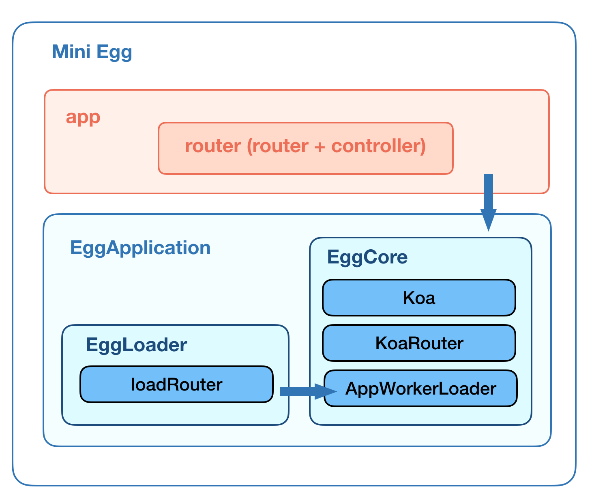

# Egg.js最小系统

## 最小系统结构

### mini结构图



根据以上的 mini Egg.js 结构图可以看出，最小Egg.js系统可以列出以下内容: 

- `EggApplication` Egg.js 应用类
  - `EggCore` Egg.js 核心类
    - `Koa` Koa.js 2.x
    - `KoaRouter` 中间件 koa-router 模块
    - `AppWorkerLoader` Egg.js 应用加载器
  - `EggLoader` Egg.js 内部加载器工具类
- `app` Egg.js 项目应用目录


## 最小系统实现

### 源码例子

demo传送门 [https://github.com/chenshenhai/eggjs-note/tree/master/demo/001-mini](https://github.com/chenshenhai/eggjs-note/tree/master/demo/001-mini)

- 进入demo目录，执行 `npm start`
- 测试
  - 访问 [http://127.0.0.1:7001/](http://127.0.0.1:7001/)
  - 访问 [http://127.0.0.1:7001/](http://127.0.0.1:7001/)

### 源码目录

```sh
.
├── app
│   └── router.js
├── index.js
├── lib
│   └── egg.js
└── package.json
```

### 源码讲解

#### mini Egg.js 源码
./lib/egg.js

```js
const fs = require('fs');
const path = require('path');
const Koa = require('koa');
const KoaRouter = require('koa-router');
const is = require('is-type-of');

const ROUTER = Symbol('EggCore#router');
const EGG_LOADER = Symbol.for('egg#loader');
const methods = [ 'head', 'options', 'get', 'put', 'patch', 'post', 'delete', 'all'];

// Router start 
class Router extends KoaRouter {
  constructor(opts, app) {
    super(opts);
    this.app = app;
  }
}
// Router end 


// EggLoader start
class EggLoader {
  constructor(options) {
    this.options = options;
    this.app = this.options.app;
  }

  loadFile(filepath, ...inject) { 
    if (!fs.existsSync(filepath)) {
      return null;
    }
    const extname = path.extname(filepath);
    if (![ '.js', '.node', '.json', '' ].includes(extname)) {
      return fs.readFileSync(filepath);
    }
    const ret = require(filepath);
    // function(arg1, args, ...) {}
    if (inject.length === 0) inject = [ this.app ];
    return is.function(ret) ? ret(...inject) : ret;
  }
}

const LoaderMixinRouter = {
  loadRouter() {  
    // 加载Egg.js应用工程目录的路由
    this.loadFile(path.join(this.options.baseDir, 'app/router.js'));
  },
}
const loaders = [
  LoaderMixinRouter,
];
for (const loader of loaders) {
  Object.assign(EggLoader.prototype, loader);
}
// EggLoader end

// EggCore start
class EggCore extends Koa {
  constructor(options) {
    options.baseDir = options.baseDir || process.cwd();
    options.type = options.type || 'application';
    super(options);

    const Loader = this[EGG_LOADER];
    this.loader = new Loader({
      baseDir: options.baseDir,
      app: this,
    });
  }

  get router() {
    if (this[ROUTER]) {
      return this[ROUTER];
    } 

    const router = this[ROUTER] = new Router({ sensitive: true }, this);
    // register router middleware
    this.beforeStart(() => {
      this.use(router.middleware());
    });
    return router;
  }

  beforeStart(fn) {
    process.nextTick(fn)
  }
}

methods.concat(['resources', 'register', 'redirect' ]).forEach(function (method) { 
  EggCore.prototype[method] = function(...args) {
    this.router[method](...args); 
    return this;
  }; 
})
// EggCore end


// EggApplication start
class AppWorkerLoader extends EggLoader {
  loadAll() {
    this.loadRouter();
  }
}

class EggApplication extends EggCore {

  constructor(options) {
    super(options);
    this.on('error', err => {
      console.error(err);
    });

    this.loader.loadAll();
  }

  get [Symbol.for('egg#eggPath')]() {
    return __dirname;
  }
  get [Symbol.for('egg#loader')]() {
    return AppWorkerLoader;
  }
}
// EggApplication end


module.exports = EggApplication;
```

#### 启动源码

./index.js

```js
const EggApplication = require('./lib/egg');
const http = require('http');

// 初始化Egg.js应用
const app = new EggApplication({
  baseDir: __dirname,
  type: 'application',
});

const server = http.createServer(app.callback());
server.once('error', err => {
  console.log('[app_worker] server got error: %s, code: %s', err.message, err.code);
  process.exit(1);
});
server.listen(7001, () => {
  console.log('server started at 7001');
});
```

#### 项目文件源码
./app/router.js

```js 
module.exports = app => {
  app.get('/index', async ctx => {
    ctx.body = 'hello index';
  });
  app.get('/', async ctx => {
    ctx.body = 'hello world';
  });
};

```

