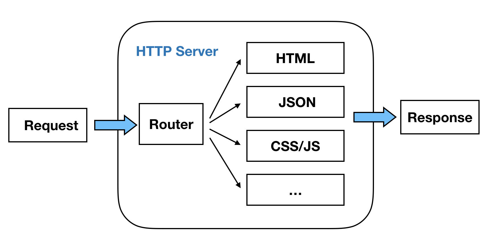

# 最小Web系统

### 为啥要说最小Web系统

解构一个框架的源码，如果直接从所有源码开始分析，那就像是在一团毛线中找出头尾，很难分析。在这里，要分析Egg.js框架的原理，就将其精简到最小功能系统，再从此一个个功能分析和叠加上去。换句话说就是先化整为零，再从零到整。

### 什么是最小Web系统

Web最小系统，就是满足Web服务最小功能系统。对于最小功能的系统，不同Web开发程序员有不同的理解。从系统分层就可以有很多方式，裁剪成最小功能那就有很多的组合。在我的理解中，最小Web系统可以精简成一下两个元素。

- `HTTP Server` HTTP服务器，处理最基本请求(Request)和响应(Response)
- `Route Parser` 路由解析器，处理不同请求URL的跳转页面或者返回数据

